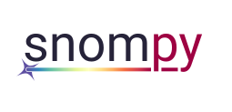

|pypi| |conda-forge| |doi|

.. |pypi| image:: https://img.shields.io/pypi/v/snompy
   :alt: PyPI - Version
.. |conda-forge| image:: https://img.shields.io/conda/v/conda-forge/snompy?label=conda-forge
   :alt: Conda Version
.. |doi| image:: https://img.shields.io/badge/DOI-10%2E48550%2FarXiv%2E2405%2E20948-blue
   :target: https://doi.org/10.48550/arXiv.2405.20948
   :alt: DOI link

A Python package for modelling scanning near-field optical microscopy measurements.

Overview
--------
The main purpose of ``snompy`` is to provide functions to calculate the effective polarizability, of a SNOM tip and a sample, which can be used to predict contrast in SNOM measurements.
It also contains other useful features for SNOM modelling, such as an implementation of the transfer matrix method for calculating far-field reflection coefficients of multilayer samples, and code for simulating lock-in amplifier demodulation of arbitrary functions.

For more details, including tutorials and example scripts, see the `snompy documentation <https://snompy.readthedocs.io/>`_.

Installation
------------

Using ``pip``::

   pip install snompy

Using ``conda``::

   conda install -c conda-forge snompy

Cite us
-------
This package is open source and free to use.
We only ask that you cite our paper, to acknowledge the time and effort that went into developing ``snompy``.
Please see the section `Cite us <https://snompy.readthedocs.io/en/latest/index.html#cite>`_ from the snompy documentation for details on how.
