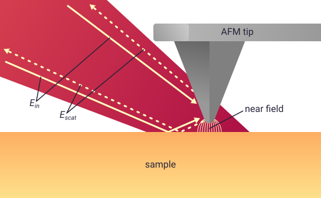

Modelling scattering in SNOM
============================

To model contrast in scanning near-field optical microscopy (SNOM)
experiments, ``pysnom`` provides two models called the finite dipole model
(FDM) and the point dipole model (PDM).
We'll explain how each model works on the following pages, but first we'll
cover some basics of SNOM modelling: effective polarisability and
demodulation.
These will be useful to understand both models.

Effective polarisability
------------------------

In both the FDM and the PDM, the SNOM contrast is modelled by calculating
the effective polarisability of an atomic force microscope (AFM) tip and
sample.
In this section we'll explain why that works.

The image below shows a typical scattering SNOM experiment, in which we
illuminate an AFM tip and sample with far-field light whose electric field
we can call :math:`E_{in}`.
This excites a near field at the apex of the AFM tip, which interacts with
the sample and scatters light with electric field :math:`E_{scat}` back
into the far-field.

The near-field information in the sample is contained in the scattering
coefficient :math:`\sigma_{scat}`, which relates the near-field scattered
light to the incident light as

.. math::

        \sigma_{scat} = \frac{E_{scat}}{E_{in}}.

When the incident light falls on the tip and sample, the electric field
induces a polarisation of the charges inside them, and a consequent dipole
moment.
The electric fields induced in the tip and sample interact, so the tip and
sample couple together to produce a combined response to the external
field.
The strength of their dipole moment, relative to the incident field, is
given by the effective polarisability of the tip and sample
:math:`\alpha_{eff}`.

It's this dipole which radiates near-field light back into the far field,
so the scattering coefficient can therefore be found from

.. math::

        \sigma_{scat} = (1 + c r)^2 \alpha_{eff},

where :math:`r` is the far-field reflection coefficient, and :math:`c` is
an empirical constant which can be used to compensate for differences
between particular experimental setups.
The :math:`(1 + c r)^2` term is included because the AFM tip is illuminated
both directly, and also by reflections from the sample surface, as shown in
the diagram above.

.. hint::

   It's common to assume that the :math:`(1 + c r)^2` term will be constant
   throughout a SNOM experiment, because the area of the far-field laser
   spot is so much bigger than the near-field-confined area probed by SNOM,
   so it's often neglected in analysis.
   However, there are many occasions where the far-field reflection
   coefficient *does* have a significant affect on results, particularly
   near large features or on cluttered substrates [1]_.
   Don't neglect it without thinking!

SNOM experiments are typically sensitive to not just the amplitude but also
the phase of the scattered light, relative to the incident light.
Because of this, :math:`\sigma_{scat}` takes the form of a complex number with
amplitude, :math:`s`, and phase, :math:`\phi`, given by

.. math::

        \begin{align*}
            s &= |\sigma_{scat}|, \ \text{and}\\
            \phi &= \arg(\sigma_{scat}).
        \end{align*}

Isolating the near field from the far field
-------------------------------------------

Typically in a SNOM experiment, we can't measure :math:`\sigma_{scat}`
directly, because the total scattered electric field from the far-field
laser spot is much, much bigger than the electric field from the near
field.

Instead, we oscillate the AFM tip height, :math:`z`,  at a frequency
:math:`\omega_{tip}`, then use a
`lock-in amplifier <https://en.wikipedia.org/wiki/Lock-in_amplifier>`_ to
demodulate the total detected signal at higher harmonics of that frequency,
:math:`n \omega_{tip}` (where :math:`n = 2, 3, 4, \ldots`).
This oscillation modulates the near field interaction, but mostly leaves
the far field unchanged, so the lock-in can extract the near-field part of
the signal by looking for only parts of the signal that change with the
right frequency.

Additionally, the non-linear :math:`z`-dependence of the near-field
interaction means we can achieve a greater near-field confinement by
choosing a higher value of :math:`n`.

Demodulation is an integral part of a SNOM experiment, so we need to
account for it in our modelling if we want accurate results.
The rest of this section will take you through how demodulation is
implemented in ``pysnom``.

As an example, lets take a look at the :math:`z`-dependence of
:math:`\alpha_{eff}` for a sample of bulk silicon (Si), calculated using
the FDM.
The following script plots the amplitude of :math:`\alpha_{eff}` for a
range of :math:`z` values from 0 to 200 nm.

.. plot:: guide/plots/basics_eff_pol_0.py
   :align: center

This shows the expected non-linear decay of the effective polarisability.

The first step in simulating the modulation and demodulation of a SNOM
signal will be to modulate the height of the AFM probe according to

.. math::

        z = z_0 + A_{tap} \left(1 + \cos(\omega_{tip}t)\right),

where :math:`z_0` is the bottom of the height oscillation :math:`A_{tap}`
is the oscillation amplitude, and :math:`t` is time.
In practice, the demodulation simulation is frequency-independent, so we
can make the simplification that :math:`\omega_{tip} = 1`.

References
----------
.. [1] L. Mester, A. A. Govyadinov, and R. Hillenbrand, “High-fidelity
   nano-FTIR spectroscopy by on-pixel normalization of signal harmonics,”
   Nanophotonics, vol. 11, no. 2, p. 377, 2022, doi:
   10.1515/nanoph-2021-0565.