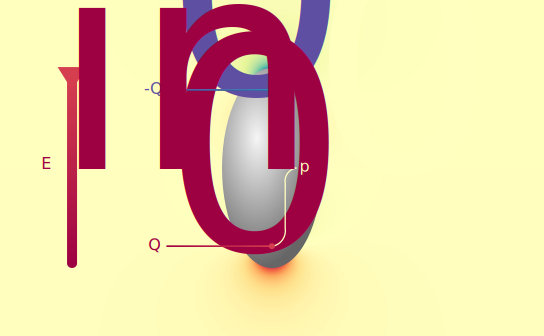

.. _bulk_fdm:

Bulk finite dipole model
========================

The finite dipole model (FDM) is a method for estimating the effective
polarisability of an atomic force microscope (AFM) tip and a sample.
This can be used to predict scattering in scanning near-field optical
microscopy (SNOM) measurements, as described on the page :ref:`scattering`.

On this page we introduce the FDM for bulk samples and give examples
showing how the bulk FDM is implemented in ``pysnom``.

Principles of the finite dipole model
-------------------------------------

The first step in the FDM is to represent the AFM tip by a perfectly
conducting ellipsoid.
This is a good approximation for the elongated probe at the tip's end, and
there is an analytical solution for its response to an electrical field.

The electric field of the incident light will vary with time, :math:`t`,
and frequency, :math:`\omega`, as :math:`E \propto E_{in} e^{i \omega t}`.
But we can make the quasistatic approximation, which assumes electric
fields change much slower than the time needed for charges in the system to
reach equilibrium.
That means we can represent the incident light by a static, vertically
oriented electric field :math:`E_{in}`.

Let's first consider the response of an isolated ellipsoid (with no sample
surface nearby) to a vertical electric field.
The image below shows the vertical component of the electric field response
of an ellipsoid to a vertical :math:`E_{in}`.

We can see that the resulting field looks like that of a dipole formed by
two charges, :math:`Q_0` and :math:`-Q_0`, close to the ends of the
ellipsoid.
This dipole, which we call :math:`p_0`, is what gives the finite dipole
model its name.
The word finite here refers to the fact that the dipole has a finite
length, and is used to contrast with the *point* dipole model
(:ref:`PDM <bulk_pdm>`), an earlier model for the effective polarisability.

* Only charge at end is close to sample, so can be treated as a point charge
* Charge in end of tip induces an image charge, which induces another charge in the tip
* That charge also has it's own image charge and counter-charge (ref Cvitkovic, all above)
* The system can be solved for the effective polarisability as: eqn (ref Hauer)
* geom function: eqn (ref Hauer)
* Properties of eff_pol_0:
  * Complex number -> amplitude and phase
  * Decays non-linearly from sample surface
  * Depends on dielectric functions of sample and environment

.. image:: diagrams/fdm.svg
   :align: center

References
----------
Keilmann
Lars depth sensitivity
Lars ratios of harmonics