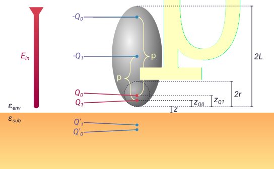

Bulk finite dipole model
========================

Principles of the finite dipole model
-------------------------------------

* AFM tip in laser -> ellipsoid in E-field
* Quasi-static approximation (E-fields change slow enough that the system is always in equilibrium)
* E-field around ellipsoid looks like finite dipole (to contrast with point dipole)
* Only charge at end is close to sample, so can be treated as a point charge
* Charge in end of tip induces an image charge, which induces another charge in the tip
* That charge also has it's own image charge and counter-charge (ref Cvitkovic, all above)
* The system can be solved for the effective polarisability as: eqn (ref Hauer)
* geom function: eqn (ref Hauer)
* Properties of eff_pol_0:
  * Complex number -> amplitude and phase
  * Decays non-linearly from sample surface
  * Depends on dielectric functions of sample and environment

References
----------
Keilmann
Lars depth sensitivity
Lars ratios of harmonics