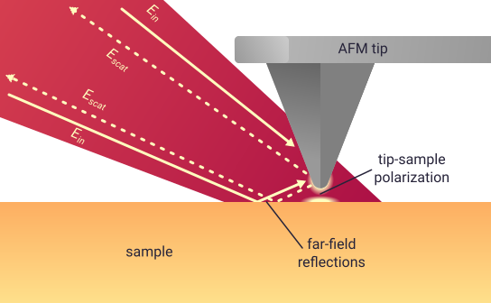
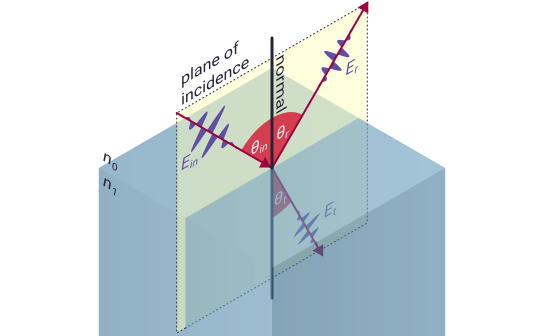

.. _far-field:

Far-field reflections
=====================

In :ref:`basics`, we showed the image below to explain why far-field reflections are important for modelling SNOM measurements.

olarization induced by the beam of light. Inside the beam of light there are two arrows labeled "E_in", one which shines onto the tip directly and one which bounces off the sample then onto the tip. There are also two arrows with dotted lines, labelled "E_scat", one which shines back along the light beam from the tip directly and one which bounces off the sample first. The point where the arrows bounce off the sample is labelled "far-field reflections".

We showed that the detected SNOM signal, :math:`\sigma_n`, depends on the effective polarizability, :math:`\alpha_{eff, n}`, and a far-field reflection term, :math:`(1 + c_r r)^2`, as

.. math::
   :label: demod_scatter_recap

   \sigma_{scat, n} = (1 + c_r r)^2 \alpha_{eff, n},

where :math:`r` is the the far-field, Fresnel reflection coefficient and :math:`c_r` is an empirical factor that describes the detected strength of the reflected light compared to the incident light.

DESCRIBE THIS PAGE.

Fresnel reflection coefficient
------------------------------

Bulk samples
^^^^^^^^^^^^

The Fresnel reflection coefficient relates the strength of a reflected light beam to the strength of the incident beam.
For a bulk sample it can be calculated simply.

The image below shows a diagram of a simple reflection from a bulk sample.
An incident light beam with electric field :math:`E_{in}` hits the sample surface.
Then, part of the beam is reflected with field :math:`E_{r}`, and part is transmitted with field :math:`E_{t}`.

The angle of the reflected beam to the surface normal, :math:`\theta_r`, is the same as the angle of incidence, :math:`\theta_{in}`, and the angle of the transmitted beam can be found from `Snell's law <https://en.wikipedia.org/wiki/Snell%27s_law>`_ as

.. math::

   n_0 \sin(\theta_{in}) = n_1 \sin(\theta_t),

where :math:`n_0` and :math:`n_1` are the refractive indices of the environment and the sample.

.. hint::
   In general, the refractive index, :math:`n`, can be found from the permittivity as :math:`n = \sqrt{\varepsilon}` for non-magnetic materials.

The value of the reflection coefficient depends on the angle and polarization, :math:`P`, of the incident light as

.. math::

   r = \begin{cases}
      r_p = \frac{n_0 \cos(\theta_{in} - n_1 \cos(\theta_{r})}{n_0 \cos(\theta_{in} + n_1 \cos(\theta_{r})}, & \text{for} \ P = p\\
      r_s = \frac{n_1 \cos(\theta_{in} - n_0 \cos(\theta_{r})}{n_1 \cos(\theta_{in} + n_0 \cos(\theta_{r})}, & \text{for} \ P = s\\
   \end{cases}

.. hint::
   The term p polarization refers to electric fields that are parallel to the plane of incidence (as shown in the drawing above).
   The term s polarisation comes from the German word senkrecht, and refers to electric fields that are perpendicular to the plane of incidence.
   In SNOM measurements we almost always use p polarisation.

Multilayer samples
^^^^^^^^^^^^^^^^^^

For multilayer samples, calculating the reflection coefficient becomes more complicated, as we must account for reflections from multiple surfaces.
In ``pysnom`` we use the `transfer matrix method <https://en.wikipedia.org/wiki/Transfer-matrix_method_(optics)>`_ to calculate reflection and transmission coefficients from multilayer samples [1]_.

Accounting for far-field in SNOM simulations
--------------------------------------------

The most common use for the far-field reflection coefficient in ``pysnom`` is to calculate the far-field factor :math:`(1 + c_r r)^2` (as in equation :eq:`demod_scatter_recap`).
In this section we'll show a worked example, by simulating a SNOM spectrum from a layer of `poly(methyl methacrylate) <https://en.wikipedia.org/wiki/Poly(methyl_methacrylate)>`_ (PMMA) on Si.

Far-field factor from a bulk reference
^^^^^^^^^^^^^^^^^^^^^^^^^^^^^^^^^^^^^^

We'll :ref:`normalize our spectrum <normalization>` to bulk Si.
Let's start by creating a :class:`~pysnom.sample.Sample` object for our reference (see :ref:`sample` for a guide to sample creation):

.. plot::
   :context:

   >>> import pysnom
   >>> eps_si = 11.7
   >>> si = pysnom.bulk_sample(eps_si)

The single permitivitty value :math:`\varepsilon = 11.7` for Si, is relatively constant across most of the mid-infrared [2]_.

Now let's calculate our far-field factor.
We'll need to define some experimental constants here:

* The fresnel reflection coefficient depends on **the angle of incidence** of the far-field beam, :math:`\theta_{in}`:
  For most SNOM experiments this is around 60°.
* **The empirical factor**, :math:`c_r`, will vary from microscope to microscope and the value should be chosen to best fit the data.
  We'll use a value of :math:`c_r = 0.3`.

.. plot::
   :context:

   >>> import numpy as np
   >>> theta_in = np.deg2rad(60)  # Angle must be in radians
   >>> c_r = 0.3
   >>> r_si = si.refl_coef(theta_in)
   >>> fff_si = (1 + c_r * r_si)**2  # Far-field factor
   >>> fff_si
   (1.173379279716862+0j)

Far-field factor from a dispersive thin film
^^^^^^^^^^^^^^^^^^^^^^^^^^^^^^^^^^^^^^^^^^^^

Now let's do the same for our PMMA sample.
First let's create a model for the permitivitty (based loosely on [2]_):

.. plot::
   :context:

   >>> wavenumber = np.linspace(1680, 1800, 128) * 1e2  # In units of m^-1
   >>> eps_inf, centre_wavenumber, strength, width = 2, 1738e2, 14e-3, 20e2
   >>> eps_pmma = eps_inf + (strength * centre_wavenumber**2) / (
   ...     centre_wavenumber**2 - wavenumber**2 - 1j * width * wavenumber
   ... )

Now we can create our sample.
Let's make it 50 nm thick, and we'll define the environment to be air (with :math:`\varepsilon_{env} = 1`).

.. plot::
   :context:

   >>> eps_air = 1.0
   >>> t_pmma = 50e-9
   >>> pmma_si = pysnom.Sample(
   ...     eps_stack=(eps_air, eps_pmma, eps_si),
   ...     t_stack=(t_pmma,),
   ...     k_vac=wavenumber,
   ... )

References
----------
.. [1] T. Zhan, X. Shi, Y. Dai, X. Liu, and J. Zi, “Transfer matrix  method for optics in graphene layers,” J Phys. Condens. Matter, vol. 25, no. 21, p. 215301, May 2013, doi: 10.1088/0953-8984/25/21/215301.
.. [2] L. Mester, A. A. Govyadinov, S. Chen, M. Goikoetxea, and R. Hillenbrand, “Subsurface chemical nanoidentification by nano-FTIR spectroscopy,” Nat. Commun., vol. 11, no. 1, p. 3359, Dec. 2020, doi: 10.1038/s41467-020-17034-6.