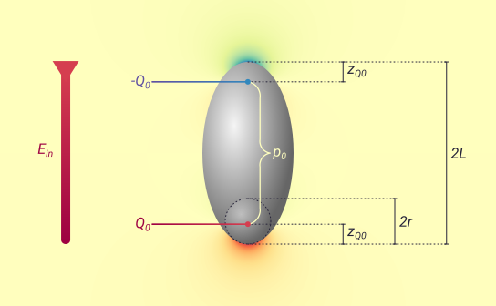
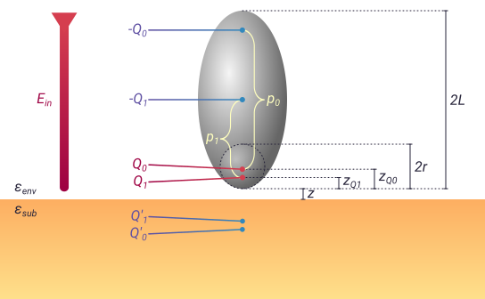

.. _fdm:

The finite dipole model
=======================

In ``pysnom``, there are three different implementations of the finite dipole model (FDM): the *bulk* implementation, the *multilayer* implementation and the *charge average* implementation.
This page gives a description of each one, with a particular focus on the derivation of the bulk FDM, from which the other implementations are derived.

Deriving the bulk FDM
---------------------

Ellipsoid model of an AFM tip
^^^^^^^^^^^^^^^^^^^^^^^^^^^^^

The first step in the FDM is to represent the AFM tip by a perfectly
conducting ellipsoid.
This is a good approximation for the elongated probe at the tip's end, and
there is an analytical solution for its response to an electrical field.

The electric field of the incident light will vary with time, :math:`t`,
and frequency, :math:`\omega`, as :math:`E \propto E_{in} e^{i \omega t}`.
But we can make the quasistatic approximation, which assumes electric
fields change much slower than the time needed for charges in the system to
reach equilibrium.
That means we can represent the incident light by a static, vertically
oriented electric field :math:`E_{in}`.

Let's first consider the response of an isolated ellipsoid (with no sample
surface nearby) to a vertical electric field.
The image below shows the vertical component of the electric field response
of an ellipsoid to a vertical :math:`E_{in}`.

We can see that the resulting field looks like that of a dipole formed by
two charges, :math:`Q_0` and :math:`-Q_0`, close to the ends of the
ellipsoid [1]_.

This dipole, which we call :math:`p_0`, is what gives the finite dipole
model its name.
The word finite here refers to the fact that the dipole has a finite
length, and is used to contrast with the *point* dipole model
(:ref:`PDM <pdm>`), an earlier model for the effective polarizability.
The position of the two charges are found at distances

.. math::
   :label: z_q0_pos

   z_{Q_0} \approx \frac{1.31 L_{tip} r_{tip}}{L_{tip} + 2 r_{tip}} \left(= d_{Q_0} r_{tip} \right)

from the ends of the ellipsoid, where :math:`r_{tip}` is the radius of curvature
at the pointy end, and :math:`L_{tip}` is the semi-major axis length (the
distance from the ellipsoid centre to the pointy end).

.. hint::
   :class: toggle

   For the depths of charges inside the end of the tip, it is often convenient to specify them in terms of the tip radius.
   We use the symbols :math:`d_{Q_j}` in  this documentation to represent :math:`z_{Q_j}` in units of the tip radius.

The strength of the electric dipole moment can be related to the charges
and their separation as

.. math::
   :label: p_0

   p_0 = 2 (L_{tip} - z_{Q_0}) Q_0 \quad (\approx 2 L_{tip} Q_0, \ \mathrm{for} \ r_{tip} \ll L_{tip}).

Tip-sample interaction
^^^^^^^^^^^^^^^^^^^^^^

Now let's consider what happens when we move our model AFM tip close to a
sample's surface, with a tip-sample separation of :math:`z_{tip}`.

When they are close enough, charges induced in the ellipsoid will interact
with the sample.
But due to the elongated shape, we can make the approximation that this
only happens for the lower of the two charges.
The other charge is too far away.
This means that we can neglect the effect of the :math:`-Q_0` charge, and
model the sample response as the response to a single point charge
:math:`Q_0` [1]_.

The image below shows the various induced charges, counter charges, and
image charges which are used in the FDM to model the tip-sample
interaction.

We can model the electric field response of the sample to the charge
:math:`Q_0`, at a height of :math:`z_{tip} + z_{Q_0}`, using
the
`method of image charges <https://en.wikipedia.org/wiki/Method_of_image_charges>`_.

This means we can add a fictitious image charge, :math:`Q_0' = -\beta Q_0`,
at a depth of :math:`z_{tip} + z_{Q_0}` below the surface.
Here, :math:`\beta` is the quasistatic  reflection coefficient of the
surface, given by

.. math::
   :label: beta

   \beta =
   \frac{\varepsilon_{sub} - \varepsilon_{env}}
   {\varepsilon_{sub} + \varepsilon_{env}},

where :math:`\varepsilon_{env}` is the permitivitty of thee nvironment
(:math:`\varepsilon_{env} = 1` for air or vacuum), and
:math:`\varepsilon_{sub}` is the permitivitty of the sample (the subscript
"sub" here is short for substrate).
In ``pysnom``, equation :eq:`beta` is provided by the function
:func:`pysnom.sample.Sample.refl_coef_qs`.

The charge :math:`Q_0'` acts back on the tip and induces a further
polarization, which we can model as another point charge :math:`Q_1`, at a
distance :math:`z_{Q_1} \approx r_{tip} / 2` away from the end of the tip.

.. hint::
   :class: toggle

   Modelling the response of the tip to :math:`Q_0'` as a single point
   charge is just an approximation.
   In reality, the polarization induced in the tip has a complicated charge
   distribution which is quite tricky to calculate [1]_.
   But replacing that distribution with a single, representative point
   charge allows us to solve the electrostatic equations, and gives a model
   that matches well to experimental results.

With the addition of :math:`Q_1`, we need to add some more charges to our
model:
the sample response to :math:`Q_1` can be represented by another image
charge, :math:`Q_1' = \beta Q_1`, at a depth of :math:`z_{tip} + z_{Q_1}` below
the surface;
and, for conservation of charge within the tip, :math:`Q_1` must have a
counter charge :math:`-Q_1`, which is situated in the centre of the
ellipsoid.

The value of :math:`Q_1` can be solved for by accounting for contributions
to the overall polarization from :math:`Q_0` and also from :math:`Q_1`
itself [2]_, as

.. math::
   :label: q_1

   Q_1 = \beta (f_0 Q_0 + f_1 Q_1)

(neglecting the influence of the :math:`-Q_1` charge as it's far from the
sample).

Here, the parameters :math:`f_j` account for the geometrical features of
the tip, and the positions of the charges within them.
They are given by the formula

.. math::
   :label: f_j_bulk

   f_j = \left(g - \frac{r_{tip} + 2 z_{tip} + z_{Q_j}}{2 L_{tip}} \right)
   \frac{\ln\left(\frac{4 L_{tip}}{r_{tip} + 4 z_{tip} + 2 z_{Q_j}}\right)}
   {\ln\left(\frac{4 L_{tip}}{r_{tip}}\right)},

where :math:`g \approx 0.7` is an empirical factor that describes how much
of the induced charge is relevant for the near-field interaction.
In ``pysnom``, equation :eq:`f_j_bulk` is provided by the function
:func:`pysnom.fdm.geom_func`.

The charges :math:`Q_1` and :math:`-Q_1` form another dipole

.. math::
   :label: p_1

   p_1 = (L_{tip} - z_{Q_1}) Q_1 \quad (\approx L_{tip} Q_1, \ \mathrm{for} \ r_{tip} \ll L_{tip}).

The effective polarizability of the tip and sample can then be found from
the total induced dipole, as

.. math::
   :label: eff_pol_bulk_fdm

   \alpha_{eff}
   = \frac{p_0 + p_1}{E_{in}}
   \approx \frac{2 L_{tip} Q_0}{E_{in}}
   \left(1 + \frac{f_0 \beta}{2 (1 - f_1 \beta)}\right)
   \propto 1 + \frac{f_0 \beta}{2 (1 - f_1 \beta)}.

In ``pysnom``, equation :eq:`eff_pol_bulk_fdm` is provided by the function
:func:`pysnom.fdm.eff_pol`, with the argument `method="bulk"`.

Extending to multilayer samples
-------------------------------

The multilayer method
^^^^^^^^^^^^^^^^^^^^^

Hauer *et al.* proposed a method to extend the FDM to multilayer samples [2]_.
In this method, the response of the multilayer sample to a charge :math:`Q_j` is modelled with a single image charge :math:`Q_j'={\beta}_{j} Q_j` at a depth :math:`d_{Q_j'}` below the sample surface.

The effective depth and reflection coefficient for the charge are chosen to be those that preserve the normal electric field :math:`E_z` and potential :math:`\phi` at the surface of the sample using :func:`pysnom.sample.Sample.image_depth_and_charge`, as:

.. math::
   :label: multilayer_bcs

    \begin{aligned}
        d_{Q_j'}    & = \left|\frac{\left.{\phi}\right|_{z=0}}{\left.E_z\right|_{z=0}}\right| - z_{Q_j}, \quad \mathrm{and} \\
        {\beta}_{j} & = \frac{\left(\left.{\phi}\right|_{z=0}\right)^2}{\left.E_z\right|_{z=0}}
    \end{aligned}

The potential and field can be calculated using :func:`pysnom.sample.Sample.surf_pot_and_field`, from:

.. math::
   :label: phi_E

    \begin{aligned}
        \left.{\phi}\right|_{z=0} & = \int_0^{\infty} \beta(q) e^{-2 z_{Q_j} q} dq, \quad \mathrm{and} \\
        \left.E_z\right|_{z=0}       & = \int_0^{\infty} \beta(q) q e^{-2 z_{Q_j} q} dq
    \end{aligned}

Here :math:`q` is the in-plane momentum of light, and :math:`\beta(q)` is the effective quasistatic reflection coefficient for the surface, calculated using :func:`pysnom.sample.Sample.refl_coef_qs`.

These values can then be inserted into a modified version of equation :eq:`eff_pol_bulk_fdm`, as:

.. math::
   :label: multilayer

   \alpha_{eff}
   \propto 1 + \frac{f_0 \beta_0}{2 (1 - f_1 \beta_1)}.

The geometry function is also modified in this case to become:

.. math::
   :label: f_j_multi

   f_j = \left(g - \frac{r_{tip} + z_{tip} + d_{Q_j'}}{2 L_{tip}} \right)
   \frac{\ln\left(\frac{4 L_{tip}}{r_{tip} + 2 z_{tip} + 2 d_{Q_j'}}\right)}
   {\ln\left(\frac{4 L_{tip}}{r_{tip}}\right)},

In ``pysnom``, equation :eq:`multilayer` is provided by the function
:func:`pysnom.fdm.eff_pol`, with the argument `method="multi"`.

The charge average method
^^^^^^^^^^^^^^^^^^^^^^^^^

Mester *et al.* proposed another multilayer FDM method [3]_.

In this implementation, the geometry function used is the same as for the bulk FDM method, however an alternative expression for the quasistatic reflection coefficient is used, which is derived from the ratio of the fields at the height of the probe:

.. math::
   :label: beta_Q_ave

    \overline{\beta} = \frac{\int_0^{\infty} \beta(q) q e^{-2 z_{Q_a} q} dq}{\int_0^{\infty} q e^{-2 z_{Q_a} q} dq}

The height :math:`z_{Q_a}` here is the height of a single representative test charge :math:`Q_a`, whose position within the tip is chosen empirically.
Equation :eq:`beta_Q_ave` is implemented in ``pysnom`` as :func:`pysnom.sample.Sample.refl_coef_qs_above_surf`.

This can then be inserted into another modified version of equation :eq:`eff_pol_bulk_fdm`, as:

.. math::
   :label: Q_ave

   \alpha_{eff}
   \propto 1 + \frac{f_0 \overline{\beta}}{2 (1 - f_1 \overline{\beta})}.

In ``pysnom``, equation :eq:`Q_ave` is provided by the function
:func:`pysnom.fdm.eff_pol`, with the argument `method="Q_ave"`.

Demodulating the FDM
--------------------

Typically we're not interested in the raw effective polarizability, but in
the :math:`n_{th}`-harmonic-demodulated effective polarizability
:math:`\alpha_{eff, n}`.
That's because the signals measured in real SNOM experiments are determined
by the demodulated near-field scattering coefficient

.. math::
   :label: fdm_scattering

   \sigma_n \propto \alpha_{eff, n},

with amplitude and phase

.. math::
   :label: fdm_amp_and_phase

   \begin{align*}
      s_n &= |\sigma_n|, \ \text{and}\\
      \phi_n &= \arg(\sigma_n).
   \end{align*}

This is explained in detail on the dedicated page :ref:`demodulation`.

In ``pysnom``, :math:`\alpha_{eff, n}` for bulk FDM is provided by the
function :func:`pysnom.fdm.eff_pol_n`.

References
----------
.. [1] A. Cvitkovic, N. Ocelic, and R. Hillenbrand, “Analytical model for
   quantitative prediction of material contrasts in scattering-type
   near-field optical microscopy,” Opt. Express, vol. 15, no. 14, p. 8550,
   2007, doi: 10.1364/oe.15.008550.
.. [2] B. Hauer, A. P. Engelhardt, and T. Taubner, “Quasi-analytical model
   for scattering infrared near-field microscopy on layered systems,” Opt.
   Express, vol. 20, no. 12, p. 13173, Jun. 2012,
   doi: 10.1364/OE.20.013173.
.. [3] L. Mester, A. A. Govyadinov, S. Chen, M. Goikoetxea, and R.
   Hillenbrand, “Subsurface chemical nanoidentification by nano-FTIR
   spectroscopy,” Nat. Commun., vol. 11, no. 1, p. 3359, Dec. 2020,
   doi: 10.1038/s41467-020-17034-6.