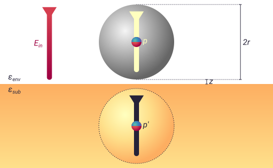

.. _pdm:

The point dipole model
======================

The point dipole model (PDM) is an older alternative to the :ref:`fdm` which typically has less quantitative agreement with experiment [1]_.
However, it has some advantages in that it is conceptually simpler and can account for the dielectric function of the AFM tip, so it is also featured in ``pysnom``.

Principles of the point dipole model
-------------------------------------

In the PDM, the tip is first modelled as a dielectric sphere whose response to electric fields is then represented by a single point dipole, located in the sphere's centre as shown in the image below.

The effective polarizability is then derived from the interaction with that dipole and an image dipole.
In ``pysnom`` it can be calculated using :func:`pysnom.pdm.eff_pol`, which implements:

.. math::
   :label: pdm

    {\alpha}_{eff} = \frac{{\alpha}_{tip}}{1 - f \beta}

Here :math:`{\alpha}_{tip}` represents the polarizability of the model sphere, which relates to the tip permittivity :math:`\varepsilon_{tip}` and radius :math:`r_{tip}` as:

.. math::
   :label: alpha_tip

    {\alpha}_{tip} = 4 \pi r_{tip}^3 \frac{\varepsilon_{tip} - 1}{\varepsilon_{tip} + 2}

The function :math:`f` encapsulates extra geometric properties of the system and is given by:

.. math::
   :label: geom_point

    f = \frac{{\alpha}_{tip}}{16 \pi \left(r_{tip}, + z_{tip}\right)^3}

References
----------
.. [1] A. Cvitkovic, N. Ocelic, and R. Hillenbrand, “Analytical model for
   quantitative prediction of material contrasts in scattering-type
   near-field optical microscopy,” Opt. Express, vol. 15, no. 14, p. 8550,
   2007, doi: 10.1364/oe.15.008550.