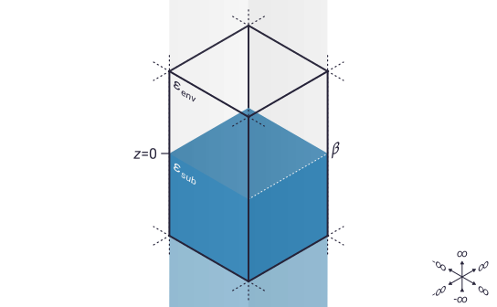
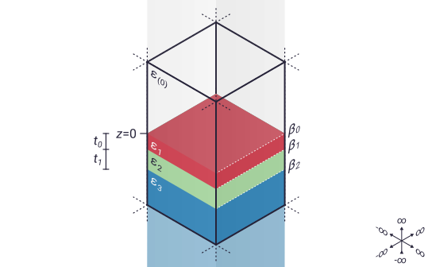

.. _sample:

Working with samples
====================

Samples in ``snompy`` are represented by instances of the :class:`~snompy.sample.Sample` class.
This page gives an overview of how samples are modelled in the :ref:`finite dipole model  (FDM) <fdm>` and :ref:`point dipole model (PDM) <pdm>`, with examples of how to create different types of :class:`~snompy.sample.Sample` object in ``snompy``.

.. note::
   The way that different kinds of material interact with light can be described by their `relative permittivity <https://en.wikipedia.org/wiki/Relative_permittivity>`_, :math:`\varepsilon`, which relates their absolute permittivity to the `vacuum permittivity <https://en.wikipedia.org/wiki/Vacuum_permittivity>`_, :math:`\varepsilon_{0}`.

   In the documentation for ``snompy``, we will always use the term permittivity, to refer to the *relative*, not absolute, permitivitty.

Bulk samples
------------

The simplest sort of sample to use for SNOM modelling is a bulk sample.
These are infinite in the :math:`x` and :math:`y` directions, and are made of:

*  **a semi-infinite environment** (sometimes called the superstrate), with permitivitty :math:`\varepsilon_{env}` (which usually :math:`= 1`, for an air or vaccuum environment), stretching from :math:`z=0` to :math:`+\infty`,
*  **a surface** at :math:`z=0`, with a quasistatic reflection coefficient of

   .. math::

      \beta = \frac{\varepsilon_{sub} - \varepsilon_{env}}{\varepsilon_{sub} + \varepsilon_{env}},

*  **a semi-infinite substrate**, with permitivitty :math:`\varepsilon_{sub}`, stretching from :math:`z=0` to :math:`-\infty`.

The image below shows a cross-section of a simple bulk sample.

Creating bulk samples
^^^^^^^^^^^^^^^^^^^^^

In ``snompy``, bulk samples can be created with the :func:`~snompy.sample.bulk_sample` function.

Let's create a Si substrate as a first example.
The permitivitty of Si in the mid-infrared (IR) is :math:`\varepsilon = 11.7` [1]_, so we can create our sample as:

.. plot::
   :context:

   >>> import snompy
   >>> eps_si = 11.7
   >>> si = snompy.bulk_sample(eps_si)

Let's take a look at some of the properties of the object we've just made:

.. plot::
   :context:

   >>> type(si)
   <class 'snompy.sample.Sample'>
   >>> si.eps_stack
   array([ 1. +0.j, 11.7+0.j])

We can see that :func:`~snompy.sample.bulk_sample` creates an instance of the :class:`~snompy.sample.Sample` class.
The layers of the sample are represented by a complex array of :math:`\varepsilon` values called `eps_stack`, which for our simple bulk sample has just two elements.
The first of these corresponds to the environment, and the second to the substrate.

.. hint::

   We didn't have to specify the environment dielectric here, as we just used the default value of 1, but if needed :func:`~snompy.bulk_sample` has an optional argument `eps_env`.

We can recover the quasistatic reflection coefficient of the sample using the function :func:`~snompy.sample.Sample.refl_coef_qs`:

.. plot::
   :context:

   >>> beta_si = si.refl_coef_qs()
   >>> beta_si
   (0.84251968503937+0j)

Sometimes it's more convenient to specify a sample using its quasistatic reflection coefficient, rather than its permitivitty.
This can be done easily like:

.. plot::
   :context:

   >>> si_from_beta = snompy.bulk_sample(beta=beta_si)
   >>> si_from_beta.eps_stack
   array([ 1. +0.j, 11.7+0.j])

We can see that creating samples via `eps_sub` and `beta` lead to equivalent results.

Creating dispersive samples
^^^^^^^^^^^^^^^^^^^^^^^^^^^

Samples studied in SNOM experiments often have dispersive dielectric functions (which means their permitivitty changes depending on the frequency of the incident light).
Let's create a dispersive sample similar to `poly(methyl methacrylate) <https://en.wikipedia.org/wiki/Poly(methyl_methacrylate)>`_ (PMMA).

To begin with, we'll define a dielectric function for our material (based loosely on reference [1]_):

.. plot::
   :context:

   >>> import numpy as np
   >>> wavenumber = np.linspace(1680, 1800, 128) * 1e2  # In units of m^-1
   >>> eps_inf, centre_wavenumber, strength, width = 2, 1738e2, 4.2e8, 20e2
   >>> eps_pmma = snompy.sample.lorentz_perm(
   ...     wavenumber,
   ...     nu_j=centre_wavenumber,
   ...     gamma_j=width,
   ...     A_j=strength,
   ...     eps_inf=eps_inf
   ... )

This is just a single `Lorentzian oscillator <https://en.wikipedia.org/wiki/Lorentz_oscillator_model>`_.
Let's visualise it with a quick plot:

.. plot::
   :context:

   >>> import matplotlib.pyplot as plt
   >>> fig, ax = plt.subplots()
   >>> ax.plot(wavenumber, eps_pmma.real, label="real")
   >>> ax.plot(wavenumber, eps_pmma.imag, label="imag")
   >>> ax.set(
   ...     xlim=(wavenumber.max(), wavenumber.min()),
   ...     xlabel=r"$\nu$ / m$^{-1}$",
   ...     ylabel=r"$\varepsilon$",
   ... )
   >>> ax.legend()
   >>> fig.tight_layout()
   >>> plt.show()

.. plot::
   :context:
   :include-source: false

   plt.close()

Now that we've created our dispersive dielectric function, we can pass it to our :func:`~snompy.sample.bulk_sample` function.
We can also give it the wavenumber corresponding to each :math:`\varepsilon` value as the optional argument `nu_vac` (which will be useful for some functions which depend on both parameters):

.. plot::
   :context:

   >>> pmma = snompy.bulk_sample(eps_pmma, nu_vac=wavenumber)

Let's take a look at some of properties of this new sample:

.. plot::
   :context:

   >>> si.eps_stack.shape  # 2 layers with a single value for each
   (2,)
   >>> si.eps_stack
   array([ 1. +0.j, 11.7+0.j])
   >>> pmma.eps_stack.shape  # Each layer now has 128 elements
   (2, 128)
   >>> pmma.eps_stack[:, :4]  # First four values in each layer only
   array([[1.        +0.j        , 1.        +0.j        ,
           1.        +0.j        , 1.        +0.j        ],
          [2.20736131+0.03514527j, 2.21053732+0.03628489j,
           2.21381045+0.03748023j, 2.21718504+0.03873494j]])

For our new sample, `eps_stack` still has 2 layers (corresponding to the environment and substrate), but it now also has 128 elements per layer.
That's one for each permitivitty value we used to generate it.

As before, we can use the function :func:`~sample.Sample.refl_coef_qs` to calculate the quasistatic reflection coefficient, which should have the same shape as `eps_pmma` and `wavenumber`:

.. plot::
   :context:

   >>> beta_pmma = pmma.refl_coef_qs()
   >>> beta_pmma.shape
   (128,)
   >>> beta_pmma.shape == eps_pmma.shape == wavenumber.shape
   True

Let's create another plot to visualise the dielectric function and quasistatic reflection coefficient together:

.. plot::
   :context:

   >>> fig, axes = plt.subplots(nrows=2, sharex=True)
   >>> axes[0].plot(wavenumber, eps_pmma.real, label="real")
   >>> axes[0].plot(wavenumber, eps_pmma.imag, label="imag")
   >>> axes[0].set(ylabel=r"$\varepsilon$")
   >>> axes[0].legend()
   >>> axes[1].plot(wavenumber, beta_pmma.real)
   >>> axes[1].plot(wavenumber, beta_pmma.imag)
   >>> axes[1].set(
   ...     xlim=(wavenumber.max(), wavenumber.min()),
   ...     xlabel=r"$\nu$ / m$^{-1}$",
   ...     ylabel=r"$\beta$"
   ... )
   >>> fig.tight_layout()
   >>> plt.show()

.. plot::
   :context:
   :include-source: false

   plt.close()

Multilayer samples
------------------

Many samples can't be modelled simply as an infinite substrate so ``snompy`` also supports multilayer samples, with more than two materials.
Like bulk samples, these are infinite in the :math:`x` and :math:`y` directions.
A multilayer sample with a number of layers, :math:`n_{\varepsilon}`, is made of:

*  **a semi-infinite environment**, with permitivitty :math:`\varepsilon_{(0)}`, stretching from :math:`z=0` to :math:`+\infty`,

   .. note::

     We use the symbol :math:`\varepsilon_{(0)}` (with the subscript 0 in brackets) for the permitivitty of the top layer in a stack to distinguish it from :math:`\varepsilon_{0}`, the common symbol for `vacuum permittivity <https://en.wikipedia.org/wiki/Vacuum_permittivity>`_.

*  **one or more sandwiched layers**, with permitivitties :math:`\varepsilon_{i}` and finite thicknesses :math:`t_{i-1}` (for :math:`i=1, ..., n_{\varepsilon} - 2`),

   .. note::

      The indices for the corresponding :math:`\varepsilon` and :math:`t` values are offset by 1, because the first :math:`\varepsilon` layer (:math:`\varepsilon_{(0)}`) is semi-infinite and has no thickness.
      This could be accounted for by starting the :math:`t` indexing at 1, but we prefer to start at 0 to match the indexing of Python arrays.

*  **two or more interfaces** at the boundaries between layers, with quasistatic reflection coefficients of

   .. math::

      \beta_i = \frac{\varepsilon_{i+1} - \varepsilon_{i}}{\varepsilon_{i+1} + \varepsilon_{i}},

*  **a semi-infinite substrate**, with permitivitty :math:`\varepsilon_{n_{\varepsilon} - 1}`, stretching from the depth of the lowest interface to :math:`-\infty`.

The image below shows a cross-section of a multilayer sample with :math:`n_{\varepsilon} = 4`.

Creating multilayer samples
^^^^^^^^^^^^^^^^^^^^^^^^^^^

In ``snompy``, multilayer samples can be created by directly initializing an instance of the :class:`~snompy.sample.Sample` class.

Let's create sample of 100 nm of Si, suspended over air as a first example.

.. plot::
   :context:

   >>> t_si = 100e-9
   >>> eps_air = 1.0
   >>> suspended_si = snompy.Sample(
   ...     eps_stack=(eps_air, eps_si, eps_air),
   ...     t_stack=(t_si,)
   ... )

.. note::

   Even though `t_stack` has only one value here, we still must pass a list rather than a single value to the :class:`~snompy.sample.Sample` object.
   That's because ``snompy`` always uses the first axis of `t_stack` (and `eps_stack` and `beta_stack`) to store the different layers of the stack.

   The top and bottom dielectric layers in `eps_stack` have no finite thickness, so `eps_stack` must always be 2 longer than `t_stack` along the first axis.

Now let's compare our new sample with the bulk Si sample we created earlier:

.. plot::
   :context:

   >>> si.multilayer  # Bulk Si
   False
   >>> si.eps_stack
   array([ 1. +0.j, 11.7+0.j])
   >>> si.beta_stack
   array([0.84251969+0.j])
   >>> si.t_stack
   array([], dtype=float64)
   >>> suspended_si.multilayer  # Suspended Si
   True
   >>> suspended_si.eps_stack
   array([ 1. +0.j, 11.7+0.j,  1. +0.j])
   >>> suspended_si.beta_stack
   array([ 0.84251969+0.j, -0.84251969+0.j])
   >>> suspended_si.t_stack
   array([1.e-07])

As well as the `eps_stack` we looked at before, we now also look at `beta_stack`, which shows the quasistatic reflection coefficients between each interface, and `t_stack`, which shows the thickness of each sandwiched dielectric layer.
This makes it clear that bulk samples are actually just a special case of multilayer samples, with only two dielectric layers and an empty array for `t_stack`.

Creating dispersive samples with varying thickness
^^^^^^^^^^^^^^^^^^^^^^^^^^^^^^^^^^^^^^^^^^^^^^^^^^

In the section on bulk samples above, we showed how you can create a single :class:`~snompy.sample.Sample` object with an array of permitivitties to represent a dispersive sample.

Let's show the same process for multilayer samples, by creating a thin layer of 50 nm of PMMA on Si.
We already defined permitivitties for Si and PMMA above, so we can reuse the same values here:

.. plot::
   :context:

   >>> t_pmma = 50e-9
   >>> pmma_si = snompy.Sample(
   ...     eps_stack=(eps_air, eps_pmma, eps_si),
   ...     t_stack=(t_pmma,),
   ...     nu_vac=wavenumber,
   ... )

Remember that `eps_pmma` is a 128-value ``numpy`` array, but `eps_air` and `eps_si` are scalar values.
Let's compare the shape of the resulting `eps_stack` with the shapes of the inputs:

.. plot::
   :context:

   >>> [np.shape(eps) for eps in (eps_air, eps_pmma, eps_si)]
   [(), (128,), ()]
   >>> pmma_si.eps_stack.shape
   (3, 128)
   >>> pmma_si.eps_stack[:, :4]
   array([[ 1.        +0.j        ,  1.        +0.j        ,
            1.        +0.j        ,  1.        +0.j        ],
          [ 2.20736131+0.03514527j,  2.21053732+0.03628489j,
            2.21381045+0.03748023j,  2.21718504+0.03873494j],
           [11.7       +0.j        , 11.7       +0.j        ,
            11.7       +0.j        , 11.7       +0.j        ]])

We can see that ``snompy`` automatically pads the input permitivitties so that each layer of the stack has the same shape.
This same process also works for `beta_stack` and `t_stack`.

What if we want to also vary the thickness of the PMMA?
As we did for the permitivitty, we can create a single :class:`snompy.sample.Sample` object with a range of thickness values.
In fact, ``snompy`` takes advantage of `numpy broadcasting <https://numpy.org/doc/stable/user/basics.broadcasting.html>`_, meaning that one sample can have both a range of thickness values and a range of permitivitties, as long as all the input arrays broadcast nicely with each other.

We can check whether two arrays broadcast nicely by adding them together.
If we don't get an error, the shape of the resulting array should tell us our broadcast shape:

.. plot::
   :context:

   >>> t_pmma_varied = np.linspace(1, 400, 32) * 1e-9
   >>> t_pmma_varied = t_pmma_varied[:, np.newaxis]  # Add new axis for broadcasting
   >>> (eps_pmma + t_pmma_varied).shape  # Error if arrays don't broadcast
   (32, 128)

Now we know our arrays broadcast nicely, let's show the advantage of broadcasting, by calculating the far-field reflection spectrum for all 32 thicknesses of PMMA in one vectorized calculation (see :ref:`far-field` for more detail):

.. plot::
   :context:

   >>> pmma_si_varied = snompy.Sample(
   ...     eps_stack=(eps_air, eps_pmma, eps_si),
   ...     t_stack=(t_pmma_varied,),
   ...     nu_vac=wavenumber,
   ... )
   >>> theta_in = np.deg2rad(70)  # Incident angle of light
   >>> r_p = pmma_si_varied.refl_coef(theta_in=theta_in)
   >>> r_p.shape
   (32, 128)

We can see that our far-field reflection coefficient `r_p` has the same shape as the broadcast array from our inputs.
Let's plot this in 3D to see what this looks like:

.. plot::
   :context:

   >>> fig, ax = plt.subplots(subplot_kw={"projection":"3d"})
   >>> for i, t in enumerate(t_pmma_varied * 1e9):
   ...     l_real, = ax.plot(
   ...         wavenumber * 1e-2,
   ...         r_p[i].real,
   ...         t,
   ...         zdir="x",
   ...         c='C0'
   ...     )
   ...     l_imag, = ax.plot(
   ...         wavenumber * 1e-2,
   ...         r_p[i].imag,
   ...         t,
   ...         zdir="x",
   ...         c='C1'
   ...     )
   >>> ax.set(
   ...    xlabel=r"$t_{PMMA}$ / nm",
   ...    ylabel=r"$\nu$ / cm$^-1$",
   ...    zlabel=r"$r_p$",
   ... )
   >>> ax.legend((l_real, l_imag), ("real", "imag"))
   >>> fig.tight_layout()
   >>> plt.show()

.. plot::
   :context:
   :include-source: false

   plt.close()

Momentum-dependence
^^^^^^^^^^^^^^^^^^^

For multilayer samples, calculating the effective quasistatic reflection coefficient from the whole stack becomes more complicated, as it depends on the in-plane momentum, :math:`q`, of the incident light.
This can be accounted for with the optional argument `q` to :func:`~snompy.sample.Sample.refl_coef_qs`.

To show this, let's plot :math:`\beta` as a function of :math:`q` for both our bulk and suspended Si samples:

.. plot::
   :context:

   >>> q = np.linspace(0, 2 / t_si, 128)
   >>> beta_si_q = si.refl_coef_qs(q)
   >>> beta_suspended_si_q = suspended_si.refl_coef_qs(q)
   >>> fig, ax = plt.subplots()
   >>> ax.plot(q, beta_si_q.real, label="bulk")
   >>> ax.plot(q, beta_suspended_si_q.real, label="suspended")
   >>> ax.set(
   ...    xlim=(q.min(), q.max()),
   ...    xlabel=r"$q$ / m$^{-1}$",
   ...    ylabel=r"$\beta$"
   ... )
   >>> ax.legend()
   >>> fig.tight_layout()
   >>> plt.show()

For this reason, the models of effective polarizability in ``snompy`` (the :ref:`FDM <fdm>` and :ref:`PDM <pdm>`) have different methods for bulk and multilayer samples.

References
----------

.. [1] L. Mester, A. A. Govyadinov, S. Chen, M. Goikoetxea, and R.
   Hillenbrand, “Subsurface chemical nanoidentification by nano-FTIR
   spectroscopy,” Nat. Commun., vol. 11, no. 1, p. 3359, Dec. 2020,
   doi: 10.1038/s41467-020-17034-6.
