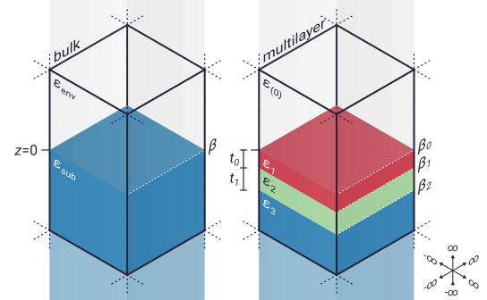

.. _sample:

Working with samples
====================

Samples in ``pysnom`` are represented by instances of the :class:`~pysnom.sample.Sample` class.
This page gives an overview of how samples are modelled in the :ref:`finite dipole model  (FDM) <fdm>` and :ref:`point dipole model (PDM) <pdm>`, with examples of how to create different types of :class:`~pysnom.sample.Sample` object in ``pysnom``.

Bulk samples
------------

The simplest sort of sample to use for SNOM modelling is a bulk sample.
These are infinite in the :math:`x` and :math:`y` directions, and are made of:

*  a semi-infinite environment (sometimes called the superstrate) stretching from :math:`z=0` to :math:`\infty`,
*  a surface at :math:`z=0`, and
*  a semi-infinite substrate stretching from :math:`z=0` to :math:`-\infty`.

In ``pysnom``, bulk samples can be created with the :func:`~pysnom.sample.bulk_sample` function.

Samples in SNOM modelling
-------------------------

Samples in the :ref:`finite dipole <fdm>` and :ref:`point dipole <pdm>` models are represented by layered structures extending infinitely in the :math:`x`-:math:`y` plane.
The top interface is at :math:`z = 0`, and above this (:math:`z > 0`) is a semi-infinite environment or superstrate.
There is also a semi-infinite substrate below the lowest interface.

The way that different kinds of material interact with light can be described by their `relative permittivity <https://en.wikipedia.org/wiki/Relative_permittivity>`_, :math:`\varepsilon`.
For the environment (typically air or vacuum) the permittivitty is usually set to :math:`\varepsilon_{env} = 1`.
Other materials typically have complex permitivitties which may depend on the frequency of the light they interact with.

There are two kinds of sample used within ``pysnom``:

*  **Bulk samples**.
   These consist of just two layers, the environment with :math:`\varepsilon=\varepsilon_{env}`, and the substrate with :math:`\varepsilon=\varepsilon_{sub}`.

   They have a single interface, which can be described by it's quasistatic reflection coefficient,

   .. math::

      \beta = \frac{\varepsilon_{sub} - \varepsilon_{env}}{\varepsilon_{sub} + \varepsilon_{env}}.

*  **Multilayer samples**.
   These consist of a number of layers, :math:`n_{\varepsilon}`, where the top layer corresponds to the environment, and has :math:`\varepsilon=\varepsilon_{(0)}`.
   All the subsequent layers have :math:`\varepsilon=\varepsilon_{i}` (where :math:`i = 1, 2, ... n_{\varepsilon}-1`), and the final layer corresponds to the semi-infinite substrate.

   .. note::

     In this documentation we use the symbol :math:`\varepsilon_{(0)}` (with the subscript 0 in brackets) for the permitivitty of the top layer in a stack to distinguish it from the common symbol for `vacuum permittivity <https://en.wikipedia.org/wiki/Vacuum_permittivity>`_, :math:`\varepsilon_{0}`.

   Multilayer samples have a stack of :math:`n_{\varepsilon} - 1` interfaces, which can be described by their quasistatic reflection coefficients

   .. math::

      \beta_i = \frac{\varepsilon_{i + 1} - \varepsilon_{i}}{\varepsilon_{i + 1} + \varepsilon_{i}}
      \quad
      (i = 0, 1, ... n_{\varepsilon}-2).

   Additionally, all of the layers except for the first and last must also have a finite thickness :math:`t=t_{i}` (where :math:`i = 0, 1, ... n_{\varepsilon}-2`).

   .. note::

      This might seem confusing, because it means that :math:`t_{i}` corresponds to the thickness of the :math:`(i + 1)^{th}` layer with permitivitty :math:`\varepsilon_{i + 1}`.
      Other sources may define the first thickness to be :math:`t_{1}` to avoid this issue, but we prefer to stick with :math:`t_{0}`, to match the Python indexing used in ``pysnom``.

The image below shows examples of both kinds of sample.

* Specifying samples in pysnom

  * Sample object can be specified by eps_stack, t_stack
  * Sample object returns quasistatic reflection coefficients
  * Sample object can be specified by beta_stack
  * eps or beta, and t can be different shapes: produces expected shape for output
  * Sample can calculate far-field Fresnel reflection for different angles, but needs to be told k_vac
  * Can also give k_vac as an argument at initialisation, as it doesn't usually change
  * Bulk samples can be made easily using :func:`~pysnom.sample.bulk_sample`.