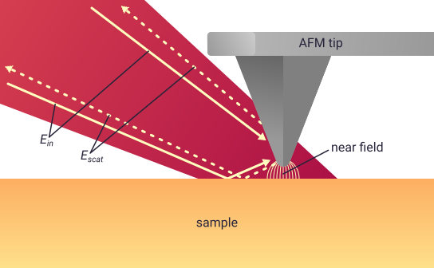

.. _scattering:

Modelling SNOM scattering
=========================

In both the finite dipole model (FDM) and the point dipole model (PDM), the
SNOM contrast is modelled by calculating the effective polarisability,
:math:`\alpha_{eff}`, of an atomic force microscope (AFM) tip and sample.
On this page we'll explain why that works.

.. note::

   In practice, it's common to use :math:`\alpha_{eff, n}`, which is
   :math:`\alpha_{eff}` demodulated at the :math:`n^{th}` harmonic of the
   AFM tip tapping frequency.
   The :ref:`demodulation` page of this guide explains why that's
   necessary, and how it's implemented in ``pysnom``.

Scattering and effective polarisability
---------------------------------------

The image below shows a typical scattering SNOM experiment, in which we
illuminate an AFM tip and sample with far-field light whose electric field
we can call :math:`E_{in}`.
This excites a near field at the apex of the AFM tip, which interacts with
the sample and scatters light with electric field :math:`E_{scat}` back
into the far-field.

The near-field information in the sample is contained in the scattering
coefficient :math:`\sigma_{scat}`, which relates the near-field scattered
light to the incident light as

.. math::
   :label: scatter_def

   \sigma_{scat} = \frac{E_{scat}}{E_{in}}.

When the incident light falls on the tip and sample, the electric field
induces a polarisation of the charges inside them, and a consequent dipole
moment.
The electric fields induced in the tip and sample interact, so the tip and
sample couple together to produce a combined response to the external
field.
The strength of their dipole moment, relative to the incident field, is
given by the effective polarisability of the tip and sample,
:math:`\alpha_{eff}`.

It's this dipole which radiates near-field light back into the far field,
so the scattering coefficient can therefore be found from

.. math::
   :label: scatter_from_eff_pol

   \sigma_{scat} = (1 + c r)^2 \alpha_{eff},

where :math:`r` is the far-field reflection coefficient, and :math:`c` is
an empirical constant which can be used to compensate for differences
between particular experimental setups.
The :math:`(1 + c r)^2` term is included because the AFM tip is illuminated
both directly, and also by reflections from the sample surface, as shown in
the diagram above.

In ``pysnom``, the undemodulated effective polarisability is provided by
the functions :func:`pysnom.fdm.eff_pol_0_bulk`,
:func:`pysnom.fdm.eff_pol_0_multi`, and :func:`pysnom.pdm.eff_pol_0_bulk`.

.. hint::
   :class: dropdown

   It's common to assume that the :math:`(1 + c r)^2` term will be constant
   throughout a SNOM experiment, because the area of the far-field laser
   spot is so much bigger than the near-field-confined area probed by SNOM,
   so it's often neglected in analysis.
   However, there are many occasions where the far-field reflection
   coefficient *does* have a significant affect on results, particularly
   near large features or on cluttered substrates [1]_.
   *Don't neglect it without thinking!*

Amplitude and phase in SNOM
---------------------------

SNOM experiments are typically sensitive to not just the amplitude but also
the phase of the scattered light, relative to the incident light.
Because of this, :math:`\sigma_{scat}` takes the form of a complex number
with amplitude, :math:`s`, and phase, :math:`\phi`, given by

.. math::
   :label: amp_and_phase

   \begin{align*}
      s &= |\sigma_{scat}|, \ \text{and}\\
      \phi &= \arg(\sigma_{scat}).
   \end{align*}

References
----------
.. [1] L. Mester, A. A. Govyadinov, and R. Hillenbrand, “High-fidelity
   nano-FTIR spectroscopy by on-pixel normalization of signal harmonics,”
   Nanophotonics, vol. 11, no. 2, p. 377, 2022, doi:
   10.1515/nanoph-2021-0565.